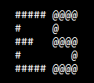

## Introduction | [<i class="fa fa-github"></i> Source Code](https://github.com/devbhuwan/easy-non-linear-equation-solver)
 

**Easy Non Linear Equation Solver** is a console application and my first project on java.It is developed to solve non linear equation already defined in application by using Numerical Techniques

This application implements following numerical techniques:

   1. Bisection Method
   2. False Position Method
   3. Secant Method
   4. Newton Raphson Method

## Screenshots

### Main Screen

### Bisection Method

### False Position Method

### Secant Method

### Newton's Raphson Method

### Not Found Screen

