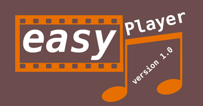
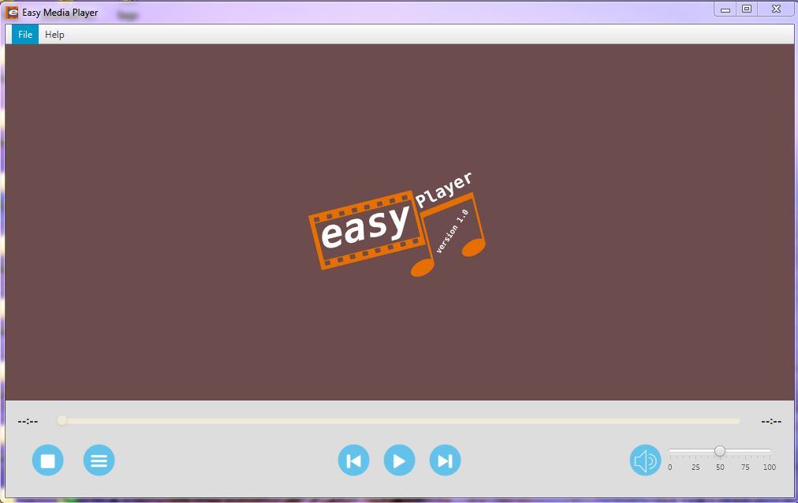
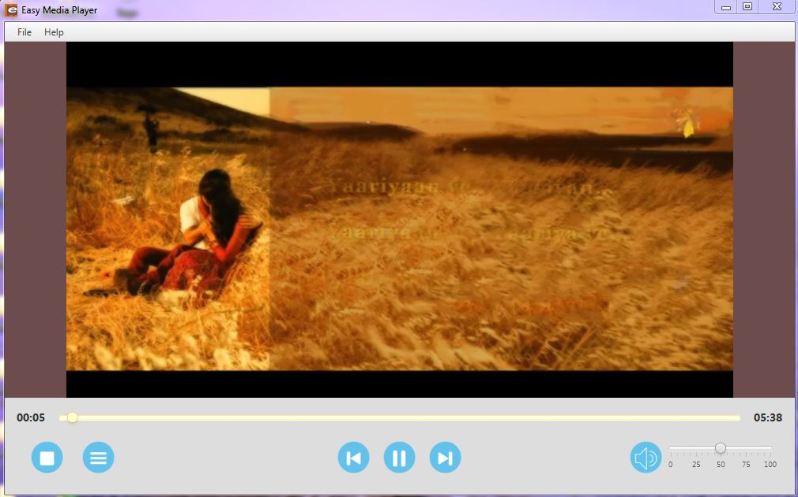
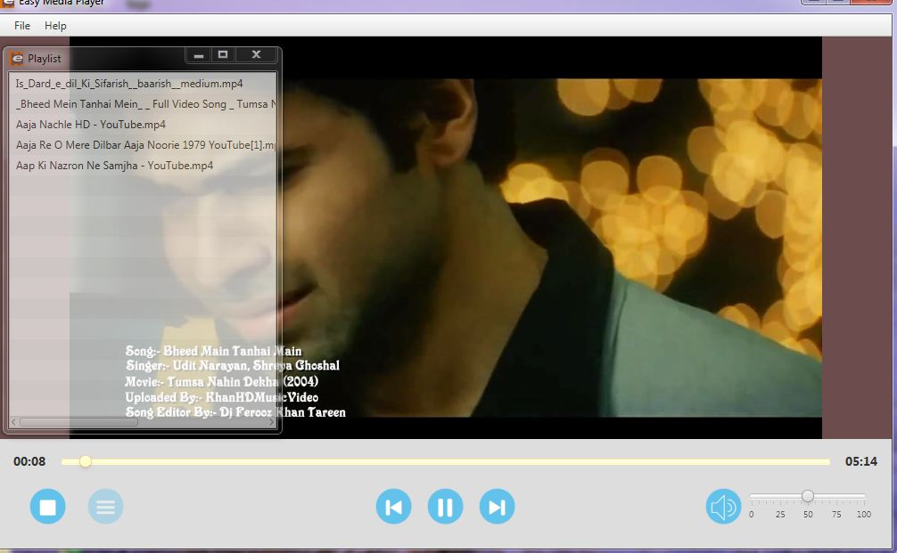

## Introduction | [<i class="fa fa-github"></i> Source Code](https://github.com/devbhuwan/easy-media-player)
 

**Easy Media Player** is a desktop application developed by using Java FX & FX supported CSS. 

Features:

1. Good User Interface
2. Easily play .mp4,.mp3, etc. file
3. Playlist control media file play
4. Control buttons such (Play,Pause,Stop,Volume Control)
5. Double Click on video then full screen video play.

## Screenshots

### Main Screen

### Playing Video

### Playlist Control
