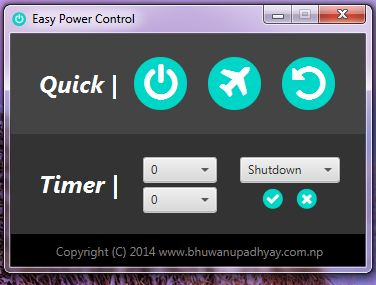

## Introduction | [<i class="fa fa-github"></i> Source Code](https://github.com/devbhuwan/easy-power-control)
 

**Easy Power Control** is a desktop application developed by using Java FX & FX supported CSS. 

Features:

1. Good User Interface
2. Quick shutdown, restart.
3. Timer shutdown, restart.

## Screenshots

### Main Screen

