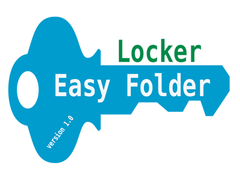

## Introduction | [<i class="fa fa-github"></i> Source Code](https://github.com/devbhuwan/easy-folder-locker)
 

**Easy Folder Locker** is a desktop application developed by using Java Swing

Features:

1. Good User Interface
2. Easily protect folder from other user
3. Password is encrypted so no fear for security
4. Easy to install and use.

## Screenshots

### Main Screen

### Change Password

