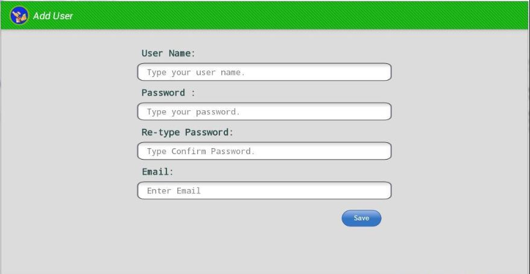
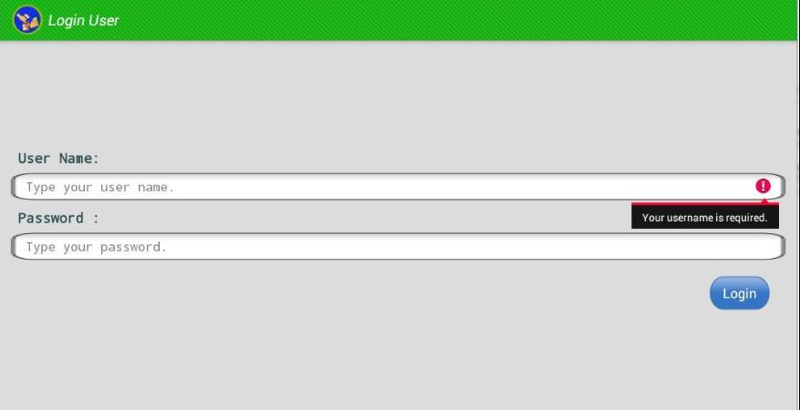

## Introduction | [<i class="fa fa-github"></i> Source Code](https://github.com/devbhuwan/easy-lend-care)
 

**Easy Lend Care** is an android application developed by using Android SDK + Java + XML and this is my first android project under GITSS Nepal.

Features:

1. Good User Interface
2. Useful for small shop to save their lend information of individual customer
3. It also calculate lend percentage
4. Easy to use.

## Screenshots

### Main Screen

### Add User

### Login

### Main View

### Detail View

