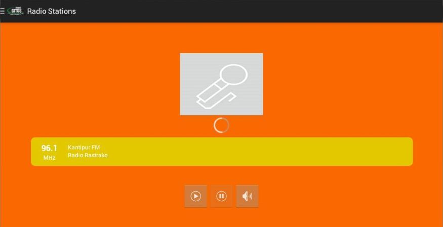

## Introduction | [<i class="fa fa-github"></i> Source Code](https://github.com/devbhuwan/easy-fm-tuner)
 

**Easy FM Tuner** is an android application developed by using Android SDK + Java + XML and this is my second android project under GITSS Nepal.

Features:

1. Good User Interface
2. It can play FM station online using Network Streaming Technology
3. It provide FM stations list dynamically from server using JSON-P(JSON Processing).
4. Easy to use.

## Screenshots

### Main Screen

### Playing FM Radio

### List of FM Radio

