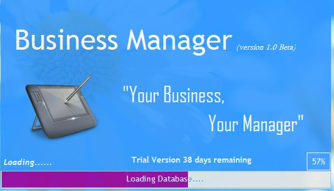
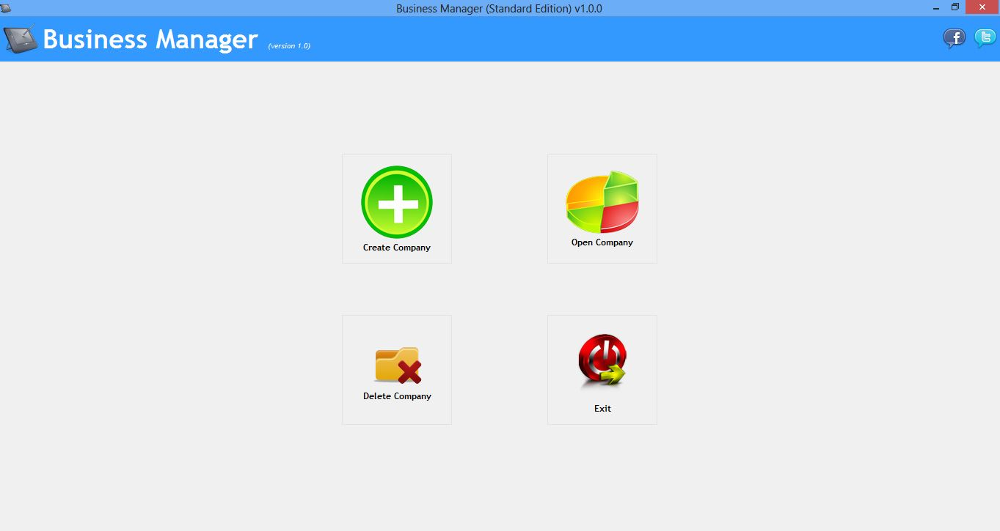
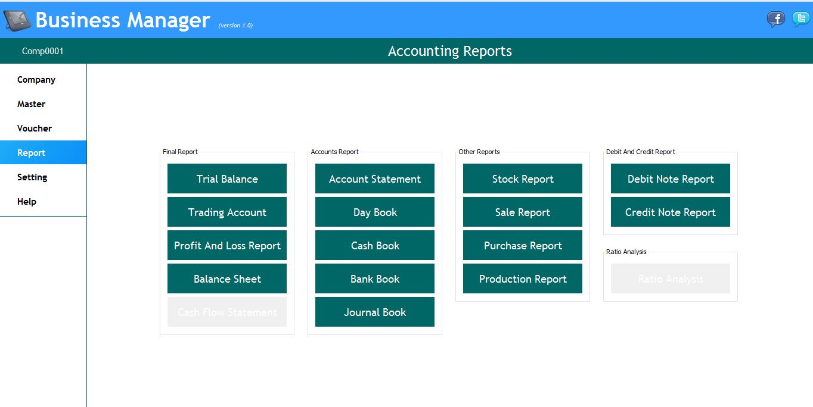

## Introduction | [<i class="fa fa-github"></i> Source Code](https://github.com/devbhuwan/easybusinessmanager)
 

**Easy Business Manager** is a desktop application developed by using Java + MS Access DB + JDBC + ODBC Bridge. This is minor project(group and closed source) project.

Features:

1. Good User Interface
2. Help to handle business daily transaction (sale, purchase, payment,etc)
3. It provides dynamic financial reports.
4. Backup data.

## Screenshots

### Splash Screen

### Create User

### Application Features

